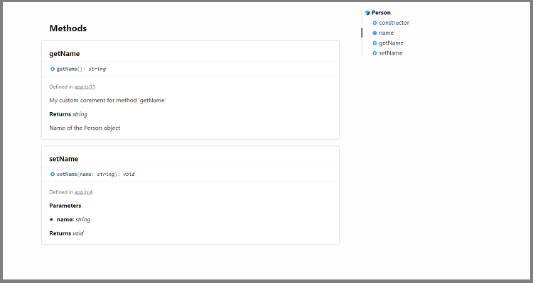
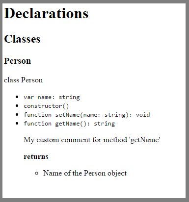

# Typescript Documentation Generator

## Available Tools

### ___typedoc___

__Description__ 

A documentation generator for TypeScript projects. TypeDoc accepts most of the command line arguments that the TypeScript compiler accepts. One major difference is the fact that one may pass an entire directory instead of individual files to the documentation generator.

__Usage__ 

```
typedoc --out path/to/documentation/ path/to/typescript/project/
```

__Screenshot__



__Pros__ 

- The documentation generator runs the TypeScript compiler and extracts the type information from the generated compiler 
symbols. Therefore you don't have to include any additional metadata within your comments.
- Is under active development
- Provide an integration with task runners like [Gulp](https://www.npmjs.org/package/gulp-typedoc/) and [Grunt](https://www.npmjs.org/package/grunt-typedoc/)

- Custom [themes](http://typedoc.io/themes/minimal/) using Handlebars

__Cons__ 

- No Visual Studio integration, plugin or anything similar

__Info__

- [Web](http://typedoc.io/)
- [Github](https://github.com/sebastian-lenz/typedoc)
- [npm](https://www.npmjs.com/package/typedoc)

### ___typescript-docs___

__Description__ 

A documentation tool for TypeScript Definition files. __typescript-docs__ works on TypeScript definition (.d.ts) files to create HTML documentation.

__Usage__

```
typescript-docs -i app.d.ts -o index.html
```

__Screenshot__



__Pros__ 

- None

__Cons__ 

- No active development
- Requires to generate definition files for source code, which it should be unnecessary
- Doesn't work with directories
- No Visual Studio integration, plugin or anything similar
- No support for custom styles or themes

__Info__

- [Github](https://github.com/paf31/typescript-docs)
- [npm](https://www.npmjs.com/package/typescript-docs)
- [Other](https://hackage.haskell.org/package/typescript-docs)

## Conclusion

Accordingly to current available tools, [typedoc](#typedoc) is the best choice

## More info

- [Link 1](http://n0n4m3.codingcorner.net/?p=28871)
- [Link 2](http://stackoverflow.com/questions/16263480/generate-documentation-for-typescript)
